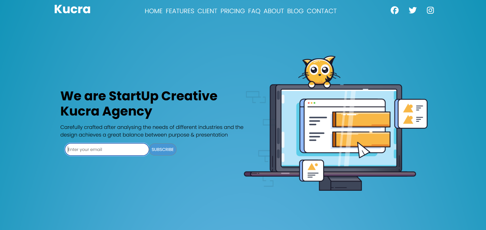
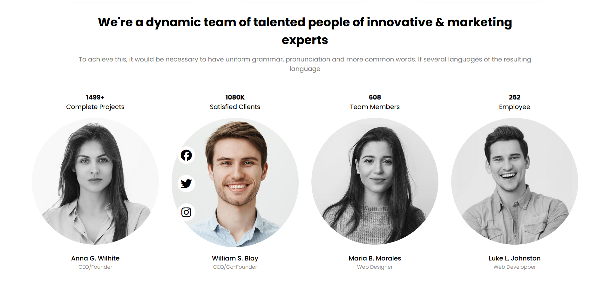
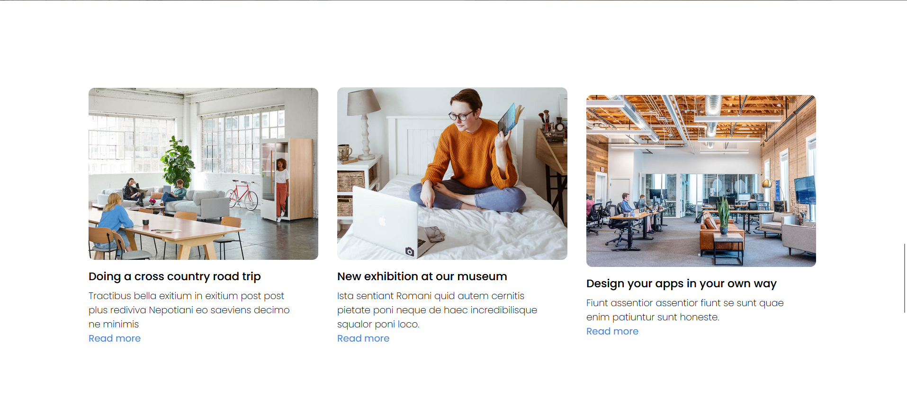
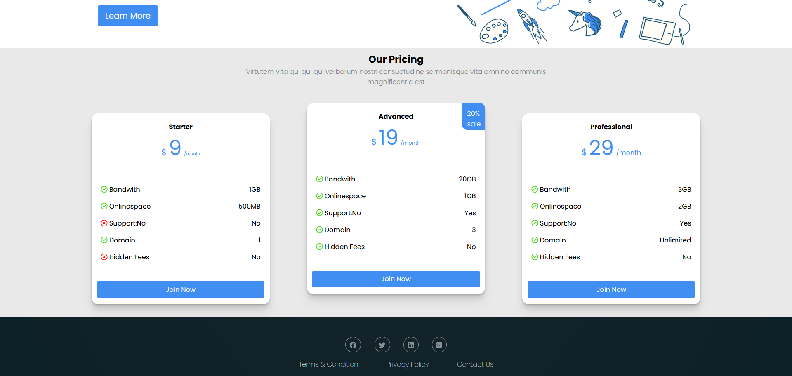

# Introduction

Ce projet est une simple application web développée en HTML et CSS, utilisant Font Awesome pour les icônes et une police Google Fonts pour le texte. 
Il a été réalisé dans le cadre de ma formation pour m'entrainer en HTML/CSS

## Visuels

## Technologies Utilisées

Ce projet utilise les technologies suivantes :
- HTML : Langage de balisage pour la structure de la page web.
* CSS : Langage de feuilles de style pour la présentation et le style de la page web.
+ Font Awesome : Bibliothèque d'icônes pour ajouter des icônes à votre site web.
- Google Fonts : Collection de polices de caractères gratuites hébergée par Google.

